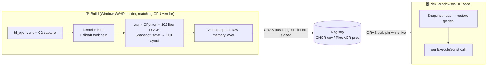
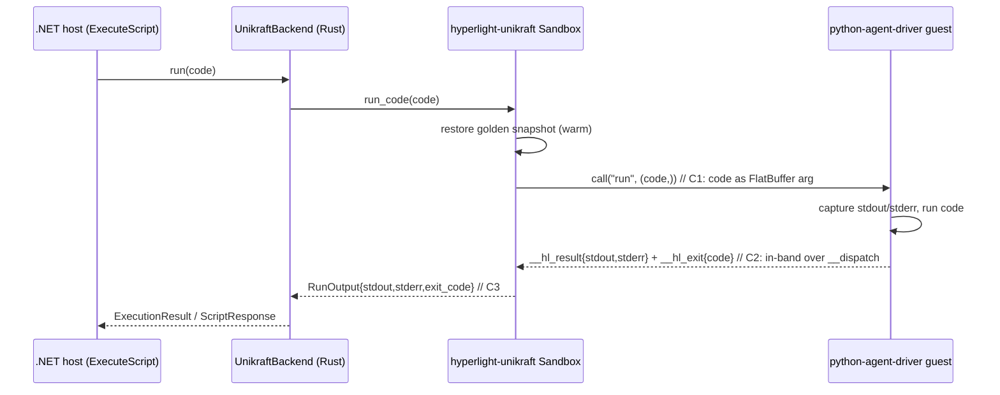

# Hyperlight‑Unikraft: library run+capture, pre‑warmed OCI snapshots, and Plex integration

> Design + how‑to for turning the `hyperlight-unikraft-sandbox` backend into a clean
> **in‑process library** (code in → `{stdout, stderr, exit_code}` out), distributed as a
> **pre‑warmed OCI snapshot**, and wired into **Plex** as a worker tier that replaces the
> Windows Hyper‑V Python container for `ExecuteScript`.

_Last updated: 2026‑06‑30. Branch: `feat/unikraft-backend-released-base` (hyperlight‑sandbox)._

---

## 1. Goal

Invoke the Unikraft micro‑VM **purely as a Rust library** from the hyperlight‑sandbox
`UnikraftBackend` — **no CLI, no subprocess, no code baked into boot argv**. Per execution:

```
backend.run(code)  ->  ExecutionResult { stdout, stderr, exit_code }   // strings, works on WHP
```

…backed by a **pre‑warmed golden snapshot** (CPython + 102 native libs already imported)
that is **built once**, stored in a registry as an **OCI artifact**, pulled per node, and
restored in ~hundreds of ms per call.

---

## 2. Verified facts (2026‑06‑30)

| Fact | Evidence |
| --- | --- |
| Released stack runs Python + pandas on **Windows/WHP** | `pyhl 0.11.0`: `print` returns, `sys.exit(7)→7`, `PANDAS_SUM 10` |
| Guest driver **already accepts per‑call code** via FlatBuffer (resident "v2 callback") | `hl_pydriver.c: py_run_user_code(fc, fc_len)` |
| `hyperlight-unikraft 0.11.0` `call_run()` sends **empty** args (`call("run", ())`) — never ships the code | `lib.rs:2644` |
| Console output bypasses capture: guest `print` → port `0xE9` → `OutBAction::DebugPrint` → **`eprint!`** (host stderr) | `hyperlight-host-0.16.0/src/sandbox/outb.rs:237` |
| `register_print`/`HostPrint` does **not** capture `print()` (different path) | `outb.rs` DebugPrint arm |
| `stderr_capture` is a **no‑op on Windows** | `hyperlight-unikraft-0.11.0/src/stderr_capture.rs:59‑75` |
| OCI snapshot save/load **landed** in the release | `hyperlight-host-0.16.0/src/sandbox/snapshot/file/mod.rs`: `save(path, &OciTag)->OciDigest` (L320), `load(path, ref)` (L660), `checked_load` (L676) |
| Snapshot is an **OCI Image Layout**, layer is **RAW** | layer mediaType `application/vnd.hyperlight.snapshot.memory.v1` (no `+zstd`/`+gzip`); blob byte 0 = x86‑64 code |
| Snapshot is **gated** to hypervisor + CPU vendor + arch | index annotations `hypervisor=whp`, `cpu.vendor=GenuineIntel`, `arch=x86_64` |
| Layer size: **1.84 GB apparent / 661 MB on disk** (sparse) | `GetCompressedFileSize` + `pyhl setup` "sparsified 653 MiB" |
| Guest heap = **1.25 GB**, baked host‑funcs = `HostPrint`, `__dispatch` | snapshot config blob |

---

## 3. Architecture

### 3.1 Build → registry → runtime



### 3.2 Per‑call (runtime, all in‑process)



---

## 4. Changes required

### C1 — Host: deliver the code per call _(small; guest already supports it)_

- **Where:** `hyperlight-unikraft` `src/lib.rs`, around `call_run()` (L2644).
- **What:** add `run_code(&mut self, code: &str) -> Result<RunOutput>` that calls
  `self.inner.call("run", (code,))` — passing the code **string as a FlatBuffer arg**
  instead of `()`. The guest's `py_run_user_code` already extracts arg0 as the code.
- **Effect:** warm `restore()` → `run_code(code)` per call with **different code each time**;
  no VM re‑evolve, no boot argv, no `argparse_escape`.

### C2 — Guest + host: return `{stdout, stderr, exit}` in‑band _(the meat; needs image rebuild)_

- **Guest (`hl_pydriver.c`):** during `run_code_with_exceptions`, redirect CPython
  `sys.stdout`/`sys.stderr` to in‑guest buffers; after the run, hand them back to the host
  by calling a host tool over the **existing `__dispatch`** channel — e.g. `__hl_result`
  with `{ "stdout": ..., "stderr": ... }` — mirroring how `__hl_exit{code}` already works.
  - Ride `__dispatch` (already in the baked host‑function contract) so **no snapshot
    re‑bake of the host‑function list** is needed.
- **Host (`hyperlight-unikraft`):** register internal `__hl_result` (and keep `__hl_exit`)
  alongside the existing internal tools (`lib.rs:1015` registers `__hl_exit`/`__hl_sleep`);
  store captured output in `Arc<Mutex<…>>`; expose via `run_code`.
- **Why not host‑side capture:** `DebugPrint → eprint!` bypasses `register_print`, and
  `stderr_capture` is a Windows no‑op. In‑band return **sidesteps the console entirely** →
  captures on **all** platforms with no OS‑level handle hackery.

### C3 — Host API + backend wiring

- **Host:** `Sandbox::run_code(code) -> RunOutput { stdout, stderr, exit_code }`
  (= `restore` + `call("run",(code,))` + collect `__hl_result` + `last_exit_code()`).
- **Backend (`src/unikraft_sandbox/src/lib.rs`):** `run_impl` collapses to
  `let o = self.vm.run_code(code)?;` → `ExecutionResult`. **Delete** `stderr_capture`,
  the temp‑file read, and the code‑in‑argv `evolve_for` (boot the resident driver **once**,
  warm, then `run_code` per call). Remove the now‑unused `stderr_capture`/`argparse_escape`.

### Image bake + OCI distribution

1. Build kernel+initrd from the **C2** `hl_pydriver.c` (unikraft/kraft toolchain).
2. Warm + `Snapshot::save(path, &OciTag)` → OCI Image Layout (raw `…memory.v1` layer).
3. **Compress** the raw layer with **zstd** for transport (1.84 GB mostly‑zeros → hundreds
   of MB). Either land a `…memory.v1+zstd` media type upstream in `hyperlight-host`, or
   compress‑on‑push / decompress‑on‑pull in the Plex pipeline.
4. `ORAS push` to GHCR (dev) / **Plex ACR** (prod); digest‑pin + **notation** sign.
5. Bake **per (hypervisor, cpu_vendor, arch)** — annotations already carry these.

### Backend OCI load (runtime)

- `Snapshot::load(oci_ref)` / `checked_load(digest)` from the pulled layout dir, then
  `restore` + `run_code` per execution.
- **Pin‑while‑live:** the layer is mmap'd as guest RAM; never delete/replace a loaded
  snapshot's backing dir (Windows `ERROR_USER_MAPPED_FILE 1224`).

### Plex integration (worker tier — plan Phase 3)

- `.NET host → hyperlight-sandbox .NET API (HyperlightSandbox.Api) → UnikraftBackend`
  (`backend="unikraft", image=<oci-ref>`).
- Add `WorkerType.AiToolsHyperlight` + `WorkerPoolType` + `HyperlightContainerService`,
  allocator mapping, SF placement; **drop `Isolation="hyperv"`** for the ExecuteScript
  service. Distribute snapshot images via Plex's existing ACR + `ImageProcessor`/
  `OrasClient`/`ContainerService` (with pin‑while‑live).

---

## 5. Caveats

1. **Hypervisor + CPU‑vendor + arch gating.** Bake on/for the target: `whp` + the node's
   CPU vendor (Intel vs AMD ⇒ **separate images**) + `x86_64`. Cross‑hypervisor portability
   (sregs normalisation) is future work.
2. **mmap immutability / pin‑while‑live.** Ref‑count loaded snapshots; never GC/replace a
   live backing dir.
3. **Raw layer.** Must be zstd‑compressed for distribution.
4. **Snapshot bakes the host‑function contract** (`HostPrint`, `__dispatch`). Keep C2 on
   `__dispatch` to avoid re‑bake churn.
5. **Heap = 1.25 GB** — sized to hold the warm lib baseline + working room; tunable per image flavor at bake time (see §7).

---

## 6. Repro — what works today

```powershell
# Released base proven on WHP (no fork, no patches):
cargo install hyperlight-unikraft --version 0.11.0
pyhl setup --dest C:\path\out        # pulls kernel+initrd (OCI), warms+saves OCI snapshot (~44s)
pyhl run  --dest C:\path\out -c "import pandas as pd; print(pd.DataFrame({'a':[1,2,3]}).sum().to_dict())"

# Backend ported to the released base (this branch), green:
cargo build -p hyperlight-unikraft-sandbox
cargo test  -p hyperlight-unikraft-sandbox     # 4 unit + 1 doctest
```

---

## 7. Memory & heap sizing (why 1.25 GB, and the dials)

The 1.25 GB is **mostly headroom on top of the warm baseline, and a bake-time dial — not a
fixed per-VM cost.**

**Where the numbers come from**
- Library default heap is **512 MiB** (`hyperlight-unikraft 0.11.0` `lib.rs:554/2440`); `pyhl
  setup` baked the python image at **1280 MiB** — a bake-time default, overridable via
  `with_heap_size()` / `SandboxBuilder::heap_size()` / `pyhl --memory`.
- **Scratch is derived from heap** (`lib.rs:593`: `max(heap/4, 64 MiB)` + page tables), so a
  1280 MiB heap silently adds **~320 MiB scratch** — a ~1.25× multiplier. Shrink the heap and
  scratch shrinks with it.

**The coupling that actually drives the size** — the heap must *contain* the warm baseline,
and that baseline **is** the preloaded libs:

```
heap  >=  baseline (~661 MB: pandas+numpy+scipy+sklearn+lxml+PIL+... resident)  +  working room
```

So you **cannot** drop the heap to 512 MB while preloading all 102 libs — they don't fit.
**The real lever is the lib set, not the heap number.** The heap is large because we chose the
*preload-everything* image; the heap just follows.

**It's a ceiling, not a fixed cost** — the heap is sparse on disk, lazy in RAM, and
**CoW-shared** across micro-VMs on a node. A 1.25 GB heap where a script touches 700 MB
≈ 700 MB real, not 1.25 GB.

**The dial — image flavors (size per workload at bake time)**

| Flavor | Preloaded | Warm baseline | Heap |
| --- | --- | --- | --- |
| `python-slim` | stdlib + a few common libs | ~100-200 MB | 256-512 MB |
| `python-data` | pandas/numpy/scipy/sklearn/... | ~661 MB | 1-1.5 GB |

Light tools (string/JSON munging) get the slim image; only data-heavy tools pay the big heap.
For real pandas/numpy work ~1.25 GB of working room is **not** unreasonable — but shipping it
to *every* tool is. Set heap **per flavor in the Plex bake pipeline**; a backend that
*restores* a snapshot inherits whatever heap was baked, so this is a **bake-time** decision,
not a runtime one.

---

## 8. Density: shared golden base (Win A — IN SCOPE)

**In scope for the base viable solution.** Pack many micro-VMs per node, all sharing ONE
golden base (read-only + per-VM CoW), so per-VM cost is just dirtied pages, not the ~1.84 GB base.

**Verified 2026-06-30 — the host crate already does it:**
- Golden mapped **shared read-only + per-VM CoW**. Windows: `CreateFileMapping(PAGE_READONLY)` +
  `MapViewOfFile3`; a surrogate **reuses the same `ReadOnlyFile` view via `use_count`** so N VMs
  share one golden (`shared_mem.rs`, `surrogate_process.rs:77-99`). Linux: file-backed
  `mmap(PROT_READ, MAP_PRIVATE|MAP_FIXED|MAP_NORESERVE)` -> shared page cache + CoW on write.
- `MultiUseSandbox::from_snapshot(Arc<Snapshot>, ...)` exists in `hyperlight-host 0.16.0`.
- CoW is fault-driven + snapshot-integrated: the guest has a real `#PF` handler
  (`hyperlight-guest-bin`: `handle_cow_pagefault` copies the page to scratch, `handle_stack_pagefault`
  demand-grows the stack). **Hyperlight is demand-paging-capable; it does NOT abort on faults.**
- Per-VM marginal = **scratch/dirtied pages**, not the base. 256 GB box: ~380 VMs (private copies)
  -> **~700-2500** (shared golden), workload-dependent. Key variable: scratch ceiling
  (heap/4 ~= 322 MB) **reserved vs lazily faulted** — TBD, sets the real ceiling.

**What we build (folds into the C1-C3 fork):**
- **D1 (`hyperlight-unikraft` crate):** expose `Sandbox::from_snapshot(Arc<Snapshot>, tools, config)`
  (the host has it; the unikraft wrapper makes one `MultiUseSandbox` per `Sandbox`, no factory). **Small.**
- **D2 (`hyperlight-sandbox` backend + .NET host):** `Snapshot::load` the golden **once per node**
  (`Arc`), then build each per-execution sandbox via `from_snapshot(shared Arc)` instead of a fresh
  warm VM. Pool **sizes to concurrency**, not active-env count. **Medium.**
- **Tests:** N=10/100 sandboxes from one golden -> footprint ~= N x scratch (not N x 1.84 GB);
  surrogate `use_count` refcount holds under spawn/restore churn.
- **Sequence:** D1 + D2 land **after C3, before OCI** (same `hyperlight-unikraft` fork).

**Future — Win B (parked):** shrink the base itself by deduping initrd->heap inside the guest
(needs Unikraft `CONFIG_LIBUKVMEM` + reconciling its paging with Hyperlight's snapshot — feasible,
since Hyperlight delivers `#PF`, but a research item). **Not** in the base solution. Also future:
scratch reserved-vs-lazy deep-tune, per-CPU-vendor bake matrix, cross-hypervisor portability.

---

## 9. Open items / sequencing

1. **C1** (host `run_code` sends code) — small, do first; unblocks per‑call without re‑evolve.
2. **C2** (guest in‑band capture + host collectors) — needs the unikraft build toolchain to
   rebuild the `python-agent-driver` image. Largest item.
3. **C3** (host `run_code` API + backend `run_impl` rewrite; delete `stderr_capture`).
4. **OCI**: confirm/parametrise zstd compression; bake‑per‑silicon; ORAS push to ACR.
5. **Plex**: `.NET host` + `AiToolsHyperlight` tier (Phase 3), pin‑while‑live image lifecycle.

> Dep note: C1–C3 + image live in **hyperlight‑unikraft** (host crate + `examples/python-agent-driver`);
> the backend `run_impl` rewrite + OCI `load` live in **hyperlight‑sandbox** (`src/unikraft_sandbox`).
